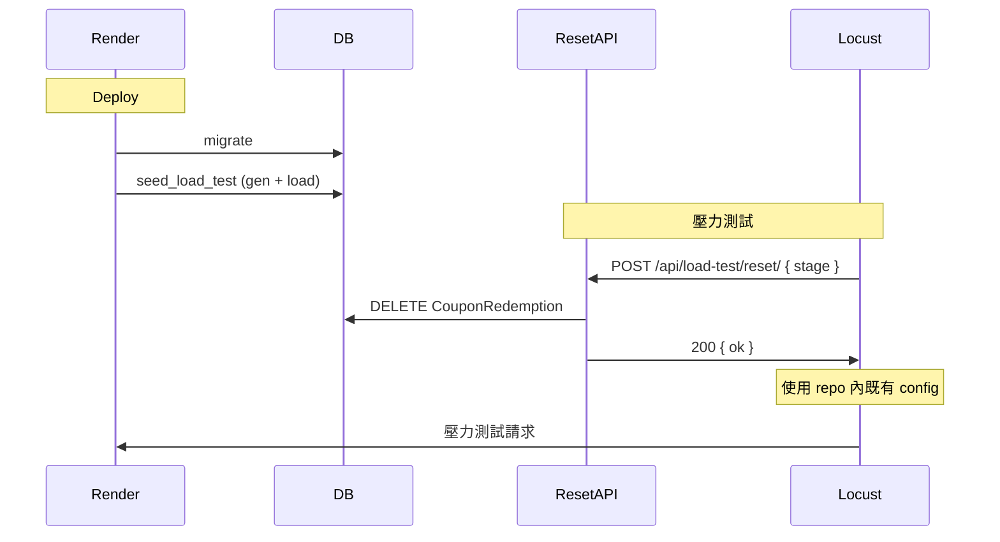

# Load Test：Deploy 時自動 Seed + Reset API 僅清庫（不回傳 Config）

**計畫名稱**：Deploy seed and reset-only API  
**概述**：遠端 deploy 時自動執行 seed 將 load test 資料寫入 DB；reset API 僅清 redemptions 並回傳 ok，不回傳 config；客戶端一律使用共用的 repo config。

---

## 目標

- **Deploy 階段**：在遠端（如 Render）每次 deploy 時自動執行 `seed_load_test`，產生並寫入 load test 的 merchants、stores、users、coupons 到 DB。
- **Reset API**：只做「清空 `CouponRedemption`」，回傳 `{"ok": true}`，**不回傳 config**；不再執行 seed。
- **Config**：客戶端與遠端共用同一份 config（repo 內 `load_tests/config/` 的 test_users.json、stores.json 等），reset 後客戶端直接使用既有 config 跑 Locust，不從 reset 回應取得 config。

## 架構概覽

## 1. Deploy 時自動跑 Seed

**做法**：在 Backend 的 **build 腳本**（或 Render 的 build/release 指令）裡，在 `migrate` 之後執行 `python manage.py seed_load_test`。

- 若目前是用 `build.sh`：在 `Backend/build.sh`（或專案根目錄的 build 指令）中，在 `python manage.py migrate` 之後加上：
  - `python manage.py seed_load_test --stage 4`
  - 或用 env `SEED_LOAD_TEST_STAGE=4`（預設 4）讓 deploy 時只跑一次 seed。
- 若 Render 是從 Dashboard 設 Build Command：改為例如  
  `pip install -r requirements.txt && python manage.py collectstatic --no-input && python manage.py migrate && python manage.py seed_load_test --stage 4`。
- **注意**：`seed_load_test` 會寫入 `load_tests/config/`（test_users.json、stores.json 等）。在 Render 上檔案系統可能是 ephemeral；客戶端使用 repo 內共用的 config，deploy 時 seed 只需負責「把資料寫進 DB」。

**建議**：在 Backend 專案內提供一個可被 Render 調用的 build 腳本（例如 `build.sh`），其中包含 migrate + seed_load_test，並在 README 或 `load_tests/README.md` 註明：遠端 deploy 時應執行 seed，且 reset API 不再做 seed。

## 2. Reset API 新行為：只清 redemptions，不回傳 config

**檔案**：`Backend/api/views/load_test.py`

- **目前**：`load_test_reset` 會 `CouponRedemption.objects.all().delete()`，然後依 request 的 `config` 有無呼叫 `seed_from_config(config, stage)` 或 `run_seed(stage)`，再 `build_load_test_config(...)` 回傳 `{ ok, config }`。
- **改為**：
  1. 只執行 `CouponRedemption.objects.all().delete()`。
  2. **不再**呼叫 `seed_from_config`、`run_seed`，也**不再**組裝或回傳 config。
  3. 回傳 `JsonResponse({"ok": True})` 即可（status 200）。
- **Request body**：可保留 `{"stage": N}` 供往後擴充，或簡化為不讀 body；client 可不送 config。

**依賴**：Deploy 時必須跑 `seed_load_test`，DB 才有 load test 用的 merchants、stores、users、coupons。客戶端使用的共用 config（repo 內 `load_tests/config/`）須與該後端對應（例如 store_ids 來自同一環境的 seed 結果並曾 commit），否則 Locust 登入/兌換可能失敗。

## 3. 客戶端（run_stage.py）行為

- 遠端跑 `run_stage.py` 時：
  - 呼叫 `POST /api/load-test/reset/` 時**不再上傳** `config`（可只送 `{"stage": N}` 或不送 body）。
  - **不再解析** reset 回應裡的 `config`；不寫入或更新 `load_tests/config/stores.json` 等檔案。
  - 直接使用 repo 內既有的 `load_tests/config/test_users.json`、`stores.json`、`task_weights.json`、`private_share_tokens.json` 跑 Locust。
- Reset 只做清庫，回應時間短，可避免長時間 timeout。

## 實作項目整理

| 項目 | 說明 |
|------|------|
| Backend build 腳本 | 在 migrate 後加入 `python manage.py seed_load_test --stage 4`（或透過 env 指定 stage）。若沒有 `build.sh` 則新增並在文件中說明 Render Build Command。 |
| load_test_reset | 只做 `CouponRedemption.objects.all().delete()`，回傳 `{"ok": true}`；移除對 `seed_from_config` / `run_seed` / `build_load_test_config` 的呼叫及 config 回傳。 |
| run_stage.py（遠端） | 呼叫 reset 時不送 `config`；收到 200 後不讀取或寫入 config，直接以既有 config 目錄跑 Locust。 |
| 文件 | 在 `load_tests/README.md` 或 Backend README 註明：遠端 deploy 時須執行 seed；reset API 僅清 redemptions、不回傳 config；客戶端共用 repo 內 config。 |

## 注意事項

- **共用 config 與後端一致**：repo 內的 `stores.json`（含 store_id）需與目標遠端 DB 一致（通常為該環境執行 seed 後產出並 commit）。若遠端 DB 重建或換環境，須重新從該環境取得 config 並更新 repo。
- **Deploy 必跑 seed**：確保 build/release 一定會跑 `seed_load_test`，否則 reset 後 DB 沒有 load test 資料，Locust 會失敗。
